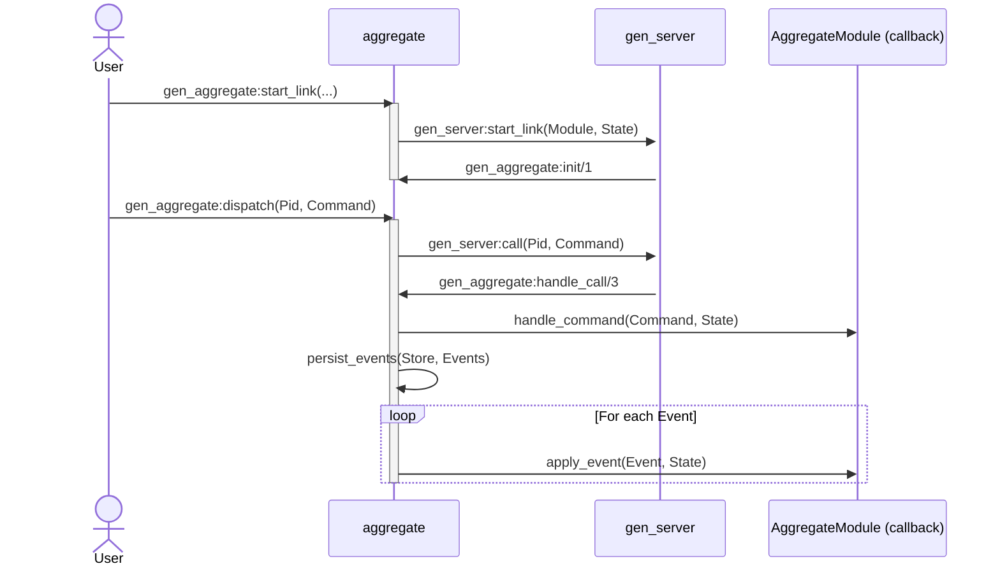

# erlang-event-sourcing-xp

> 🧪 Experimenting with Event Sourcing in Erlang using _pure functional_ principles, [gen_server](https://www.erlang.org/doc/apps/stdlib/gen_server.html)-based aggregates, and _pluggable_ Event Store backends.

## About

I'm a big fan of [Erlang/OTP][Erlang] and [Event Sourcing], and I strongly believe that the _Actor Model_ and _Event Sourcing_ are a natural fit. This repository is my way of exploring how these two concepts can work together in practice.

As an **experiment**, this repo won't cover every facet of event sourcing in depth, but it should provide some insights and spark ideas on the potential of this approach in [Erlang].

[Erlang]: https://www.erlang.org/
[Event Sourcing]: https://learn.microsoft.com/en-us/azure/architecture/patterns/event-sourcing

## Architecture

### Overview

This project is structured around the core principles of Event Sourcing:

- All changes are represented as immutable events.
- Aggregates handle commands and apply events to evolve their state.
- State is rehydrated by replaying historical events. Possible optimizations include snapshots and caching.

### Event store

The event store is a core component in this experiment, designed as a customizable `behaviour` that any `module` can implement to handle event storage. Its primary responsibilities include storing and retrieving events.

```erlang
% Initializes the event store
-callback start() -> {ok, initialized | already_initialized} | {error, term()}.

% Shuts down the event store.
-callback stop() -> {ok} | {error, term()}.

% Persists a list of events for a given stream.
-callback persist_events(StreamId, Events) -> ok | {error, term()}
    when StreamId :: stream_id(),
         Events :: [event()].

% Retrieves events from a stream and folds them using a provided function
-callback retrieve_and_fold_events(StreamId, Options, FoldFun, InitialAcc) -> {ok, Acc} | {error, term()}
    when StreamId :: stream_id(),
         Options :: fold_events_opts(),
         FoldFun :: fold_events_fun(),
         InitialAcc :: Acc.
```

#### Future Features

While not yet implemented, the event store could be extended to:

- Store snapshots of the aggregate’s state for efficient retrieval.
- Support event subscriptions for real-time updates.

#### Current Implementation

- [Mnesia](https://www.erlang.org/doc/apps/mnesia/mnesia.html)
- [ETS](https://www.erlang.org/doc/apps/stdlib/ets.html)

### Aggregate

The _aggregate_ is implemented as a [gen_server](https://www.erlang.org/doc/apps/stdlib/gen_server.html) that encapsulates _domain logic_ and delegates event persistence to a pluggable Event Store (e.g. [ETS](https://www.erlang.org/doc/apps/stdlib/ets.html) or [Mnesia](https://www.erlang.org/doc/apps/mnesia/mnesia.html)).

The core idea is to separate concerns between domain behavior and infrastructure. To achieve this, the system is structured into three main components:

- 🧩 **Domain Module** — a pure module that implements domain-specific logic via _behaviour_ callbacks.
- ⚙️ **`aggregate`** — the glue that bridges domain logic and infrastructure (event sourcing logic, event persistence, etc.).
- 🚦 [`gen_server`](https://www.erlang.org/doc/apps/stdlib/gen_server.html) — the OTP mechanism that provides lifecycle management and message orchestration.

The `aggregate` provides:

- A [behaviour](https://www.erlang.org/doc/system/design_principles.html#behaviours) for domain-specific modules to implement.
- A generic [OTP](https://www.erlang.org/doc/system/design_principles.html) [gen_server](https://www.erlang.org/doc/apps/stdlib/gen_server.html) that:
  - Rehydrates state from events on startup.
  - Processes commands to produce events.
  - Applies events to evolve internal state.
  - Automatically passivates (shuts down) after inactivity.

The following diagram shows how the system processes a command using the event-sourced aggregate infrastructure.



#### Passivation

Each aggregate instance (a `gen_server`) is automatically passivated — i.e., stopped — after a period of inactivity.

This helps:

- Free up memory in long-lived systems
- Keep the number of live processes bounded
- Rehydrate state on demand from the event store

Passivation is configured via a `timeout` value when the aggregate is started (defaults to 5000 ms):

```erlang
event_sourcing_core_aggregate:start_link(Module, Store, Id, #{timeout => 10000}).
```

When no messages are received within the timeout window:

- A passivate message is sent to the process.
- The aggregate process exits normally (`stop`).
- Its state is discarded.
- Future commands will cause the manager to rehydrate it from persisted events.

### Project organization

```plaintext
apps/event_sourcing_core
├── include
│   └── event_sourcing_core.hrl                     % Shared types and macros
├── src
│   ├── event_sourcing_core.app.src                 % Application definition
│   ├── event_sourcing_core_aggregate.erl           % Aggregate process (gen_server)
│   ├── event_sourcing_core_aggregate_behaviour.erl % Aggregate behaviour (domain contract)
│   ├── event_sourcing_core_store.erl               % Event store behaviour
│   ├── event_sourcing_core_store_ets.erl           % ETS-backed store implementation
│   └── event_sourcing_core_store_mnesia.erl        % Mnesia-backed store implementation
└── test
    ├── bank_account_aggregate.erl                  % Sample domain aggregate
    ├── event_sourcing_core_aggregate_tests.erl     % Aggregate process tests
    └── event_sourcing_core_store_tests.erl         % Store behaviour tests
```

## Build

```sh
rebar3 compile
```

## Test

```sh
rebar3 eunit
```
