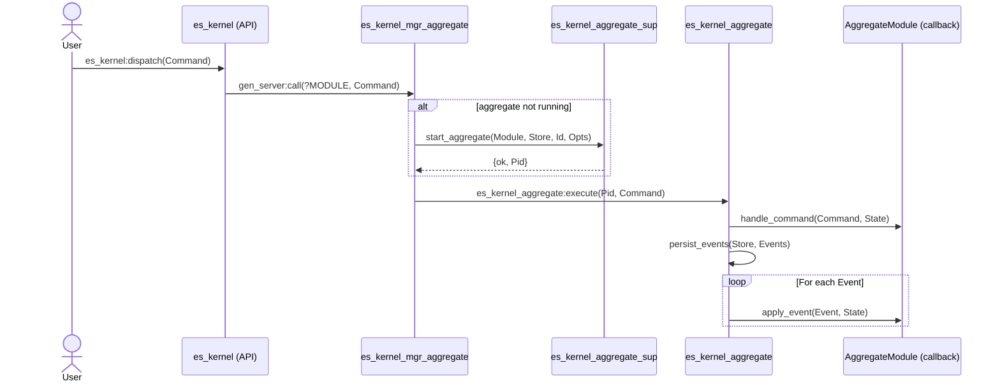
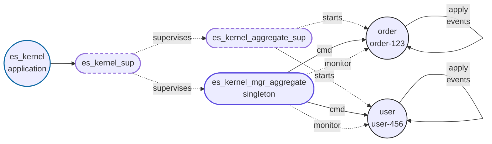

# erlang-event-sourcing-xp

> 🧪 Experimenting with Event Sourcing in Erlang using _pure functional_ principles, [gen_server](https://www.erlang.org/doc/apps/stdlib/gen_server.html)-based aggregates, and _pluggable_ Event Store backends.

[](https://www.erlang.org/)
[](https://github.com/ccamel/erlang-event-sourcing-xp/actions/workflows/lint.yml)
[](https://github.com/ccamel/erlang-event-sourcing-xp/actions/workflows/build.yml)
[](https://github.com/ccamel/erlang-event-sourcing-xp/actions/workflows/test.yml)
[](https://codecov.io/gh/ccamel/erlang-event-sourcing-xp)

[](https://github.com/ccamel/erlang-event-sourcing-xp/releases)
[](https://github.com/semantic-release/semantic-release)
[](https://github.com/ccamel/erlang-event-sourcing-xp/blob/main/LICENSE)

## About

I'm a big fan of [Erlang/OTP][Erlang] and [Event Sourcing], and I strongly believe that the _Actor Model_ and _Event Sourcing_ are a natural fit. This repository is my way of exploring how these two concepts can work together in practice.

As an **experiment**, this repo won't cover every facet of event sourcing in depth, but it should provide some insights and spark ideas on the potential of this approach in [Erlang].

[Erlang]: https://www.erlang.org/
[Event Sourcing]: https://learn.microsoft.com/en-us/azure/architecture/patterns/event-sourcing

## Features

- **Kernel OTP app** — packaged as an OTP application with a supervision tree (`es_kernel_sup`) that boots a dynamic aggregate supervisor and a singleton aggregate manager. Configure stores via application env, start with `application:ensure_all_started/1`, and dispatch commands through `es_kernel:dispatch/1`.
- **Aggregate** — a reusable [gen_server](https://www.erlang.org/doc/apps/stdlib/gen_server.html) harness that keeps domain logic pure while delegating event sourcing boilerplate.
- **Aggregate Manager** — a singleton router that spins up aggregates on demand via the dynamic supervisor, rehydrates them from persisted events, monitors them, and passivates idle instances.
- **Event Store** — a behaviour-driven abstraction with drop-in backends so you can pick the storage engine that fits your deployment.
- **Snapshots** — automatic checkpointing at configurable intervals to avoid replaying entire streams.
- **Passivation** — idle aggregates are shut down cleanly and will rehydrate from the store on the next command.

## Let's play

This project is a work in progress, and I welcome any feedback or contributions. If you're interested in [Event Sourcing](https://learn.microsoft.com/en-us/azure/architecture/patterns/event-sourcing), [Erlang/OTP](https://www.erlang.org/), or both, feel free to reach out!

Start the Erlang [shell](https://www.erlang.org/docs/20/man/shell.html) and run the following commands to play with the `es_xp` example application. `es_xp` depends on `es_store_ets` and `es_kernel`, so `application:ensure_all_started(es_xp)` brings up the full stack; commands are dispatched through `es_kernel:dispatch/1`.

<!-- DEMO-START -->

```erlang
%% Interactive demo showcasing the event sourcing engine.
%%
%% Usage:
%%     rebar3 shell < apps/es_xp/examples/demo_bank.script
%%
%% This script configures es_kernel to use the in-memory ETS backend for
%% both events and snapshots, then starts the es_xp application. es_xp
%% depends on es_store_ets and es_kernel, so `application:ensure_all_started/1`
%% brings up the full stack automatically.

%% Explicitly set the store backends (override defaults if needed)
application:load(es_kernel),
application:set_env(es_kernel, event_store, es_store_ets),
application:set_env(es_kernel, snapshot_store, es_store_ets),

io:format("~n[1] starting es_xp application (and dependencies)~n", []),
{ok, Started} = application:ensure_all_started(es_xp),
io:format(" -> ~p~n", [Started]),

AccountId = <<"bank-account-123">>,

Dispatch = fun(Type, Amount) ->
    Command =
        es_contract_command:new(
            bank_account_aggregate,
            Type,
            AccountId,
            0,
            #{},
            #{amount => Amount}
        ),
    es_kernel:dispatch(Command)
end,

io:format("[2] deposit $100~n", []),
io:format(" -> ~p~n", [Dispatch(deposit, 100)]),

io:format("[3] withdraw $10~n", []),
io:format(" -> ~p~n", [Dispatch(withdraw, 10)]),

io:format("[4] withdraw $1000 (should fail)~n", []),
io:format(" -> ~p~n", [Dispatch(withdraw, 1000)]),

ok.
```
<!-- DEMO-END -->

## Architecture

### Overview

This project is structured around the core principles of Event Sourcing:

- All changes are represented as immutable events.
- Aggregates handle commands and apply events to evolve their state.
- State is rehydrated by replaying historical events. Possible optimizations include snapshots and caching.

### Kernel application & supervision

- `es_kernel` ships as an OTP application. Start it with `application:ensure_all_started(es_kernel)` after configuring `event_store` and `snapshot_store` (defaults to `es_store_ets`).
- Start the configured store backends first (e.g., `es_store_ets:start/0`) so tables/processes exist before aggregates boot. The `es_xp` example app handles this by depending on `es_store_ets` and `es_kernel` and starting them via `application:ensure_all_started(es_xp)`.
- The top-level supervisor (`es_kernel_sup`) starts:
  - `es_kernel_aggregate_sup`: a dynamic supervisor that spawns `es_kernel_aggregate` processes on demand.
  - `es_kernel_mgr_aggregate`: a registered singleton that routes commands to aggregates and keeps track of live PIDs.
- Commands are dispatched through the public API `es_kernel:dispatch/1`, which forwards to the registered manager.

### Store abstraction

The store layer separates domain logic from persistence concerns through two behaviour contracts: `es_contract_event_store` for event persistence and `es_contract_snapshot_store` for snapshot optimization. Backends implement these behaviours, and aggregates interact with stores through the unified `es_kernel_store` API.

#### Event Store

The event store is the heart of event sourcing persistence, designed as a `behaviour` (`es_contract_event_store`) that backends implement. It guarantees **ordering** (events replayed in sequence), **atomicity** (all-or-nothing persistence), and **immutability** (events never modified).

**Required Callbacks:**

```erlang
% Appends events to a stream with monotonic sequence ordering
-callback append(StreamId, Events) -> ok
    when StreamId :: es_contract_event:stream_id(),
         Events :: [es_contract_event:t()].

% Replays events in sequence order, applying a fold function
-callback fold(StreamId, Fun, Acc0, Range) -> Acc1
    when StreamId :: es_contract_event:stream_id(),
         Fun :: fun((Event :: es_contract_event:t(), AccIn) -> AccOut),
         Acc0 :: term(),
         Range :: es_contract_range:range(),
         Acc1 :: term(),
         AccIn :: term(),
         AccOut :: term().
```

#### Snapshot Store

Snapshots provide optional **performance optimization** by checkpointing aggregate state, avoiding full event replay from stream start. They remain secondary to events, which are always the source of truth.

**Required Callbacks:**

```erlang
% Persists a snapshot; returns warning instead of crashing on failure
-callback store(Snapshot) -> ok | {warning, Reason}
    when Snapshot :: es_contract_snapshot:t(),
         Reason :: term().

% Retrieves the most recent snapshot for a stream
-callback load_latest(StreamId) -> {ok, Snapshot} | {error, not_found}
    when StreamId :: es_contract_snapshot:stream_id(),
         Snapshot :: es_contract_snapshot:t().
```

**How Snapshots Work:**

1. **On aggregate startup**: `load_latest/1` fetches the most recent snapshot (if available)
2. **Replay optimization**: Only events _after_ the snapshot sequence are replayed via `fold/4`
3. **Automatic checkpointing**: When `snapshot_interval` is configured (e.g., `10`), snapshots save at sequence multiples (10, 20, 30...)

**Configuring Snapshots:**

Set `snapshot_interval` per aggregate or globally via `es_kernel` application environment:

```erlang
% Global default in sys.config
{es_kernel, [{snapshot_interval, 10}]}

% Or programmatically
application:set_env(es_kernel, snapshot_interval, 10)
```

Setting `snapshot_interval => 0` (default) disables automatic snapshotting.

#### Additional future features

- Support event subscriptions for real-time updates.
- Implement snapshot retention policies (e.g., keep only last N snapshots).

#### Backend roadmap

| Backend                                                                     | Status     | Icon                                                                                                                               | Capabilities | Highlights                                                                                     | Ideal use cases                                                                                   |
| --------------------------------------------------------------------------- | ---------- | ---------------------------------------------------------------------------------------------------------------------------------- | ------------ | ---------------------------------------------------------------------------------------------- | ------------------------------------------------------------------------------------------------- |
| [ETS](https://www.erlang.org/doc/apps/stdlib/ets.html)       | ✅ Ready   |      | Events + snapshots | In-memory tables backed by the BEAM VM, blazing-fast reads/writes, zero external dependencies. | Local development, benchmarks, ephemeral environments where latency matters more than durability. |
| File (pedagogical)                                                          | ✅ Ready   | 📁                                                                                                                                  | Events + snapshots | Plain files (one Erlang term per line) under a configurable root dir, zero dependencies.        | Learning/teaching runs where you want to peek at persisted state without external services.       |
| [Mnesia](https://www.erlang.org/docs/29/apps/mnesia/mnesia.html) | ✅ Ready   |      | Events + snapshots | Distributed, transactional, and replicated storage built into Erlang/OTP.                      | Clusters that need lightweight distribution without introducing an external database.             |
| [PostgreSQL](https://www.postgresql.org/)                                   | 🛠️ Planned |  | Events + snapshots | Durable SQL store with strong transactional guarantees and easy horizontal scaling.            | Production setups that already rely on Postgres or need rock-solid consistency.                   |
| [MongoDB](https://www.mongodb.com/)                                         | 🛠️ Planned |     | Events + snapshots | Flexible document database with built-in replication and sharding.                             | Event streams that benefit from schemaless payload storage or multi-region clusters.              |

### Aggregate

The _aggregate_ is implemented as a [gen_server](https://www.erlang.org/doc/apps/stdlib/gen_server.html) that encapsulates _domain logic_ and delegates event persistence to a pluggable Event Store (e.g. [ETS](https://www.erlang.org/doc/apps/stdlib/ets.html) or [Mnesia](https://www.erlang.org/doc/apps/mnesia/mnesia.html)).

The core idea is to separate concerns between domain behavior and infrastructure. To achieve this, the system is structured into three main components:

- 🧩 **Domain Module** — a pure module that implements domain-specific logic via _behaviour_ callbacks.
- ⚙️ **`aggregate`** — the glue that bridges domain logic and infrastructure (event sourcing logic, event persistence, etc.).
- 🚦 [`gen_server`](https://www.erlang.org/doc/apps/stdlib/gen_server.html) — the OTP mechanism that provides lifecycle management and message orchestration.

The `aggregate` provides:

- A [behaviour](https://www.erlang.org/doc/system/design_principles.html#behaviours) for domain-specific modules to implement.
- A generic [OTP](https://www.erlang.org/doc/system/design_principles.html) [gen_server](https://www.erlang.org/doc/apps/stdlib/gen_server.html) that:
  - Rehydrates state from events on startup (with optional snapshot loading).
  - Processes commands to produce events.
  - Applies events to evolve internal state.
  - Automatically passivates (shuts down) after inactivity.
  - Saves snapshots at configurable intervals for optimization.

The following diagram shows how the system processes a command using the event-sourced aggregate infrastructure.



#### Passivation

Each aggregate instance (a `gen_server`) is automatically passivated — i.e., stopped — after a period of inactivity.

This helps:

- Free up memory in long-lived systems
- Keep the number of live processes bounded
- Rehydrate state on demand from the event store

Passivation is configured via a `timeout` value when the aggregate is started (defaults to 5000 ms):

```erlang
es_kernel_aggregate:start_link(Module, Store, Id, #{timeout => 10000}).
```

When no messages are received within the timeout window:

- A passivate message is sent to the process.
- The aggregate process exits normally (`stop`).
- Its state is discarded.
- Future commands will cause the manager to rehydrate it from persisted events.

#### Snapshots

Snapshots provide a performance optimization for aggregate rehydration by avoiding the need to replay all events from the beginning of a stream.

**How it works:**

1. **On startup**, the aggregate:

   - Attempts to load the latest snapshot from the event store
   - If found, initializes state from the snapshot
   - Replays only events that occurred after the snapshot sequence

2. **During command processing**, snapshots are automatically created when:
   - A `snapshot_interval` is configured (e.g., `10`)
   - The current sequence number is a multiple of the interval
   - For example, with `snapshot_interval => 10`, snapshots are saved at sequences 10, 20, 30, etc.

**Configuration:**

```erlang
% Create aggregate with snapshots every 10 events
es_kernel_aggregate:start_link(
    bank_account_aggregate,
    es_store_ets,
    <<"account-123">>,
    #{
        timeout => 5000,
        snapshot_interval => 10  % Save snapshot every 10 events
    }
).
```

Setting `snapshot_interval => 0` (the default) disables automatic snapshotting.

### Aggregate Manager

The _aggregate manager_ is a [gen_server](https://www.erlang.org/doc/apps/stdlib/gen_server.html) started by `es_kernel_sup` and registered as `es_kernel_mgr_aggregate`. It routes `es_contract_command:t()` to the right aggregate process (keyed by `{domain, stream_id}`), spins up instances via the dynamic supervisor, and monitors them to keep its registry clean. The store context is taken from the `es_kernel` application environment, and the public entrypoint `es_kernel:dispatch/1` forwards to this singleton.

The manager is responsible for:

- Routing commands to the appropriate aggregate process across all domains.
- Starting aggregate instances on demand through `es_kernel_aggregate_sup`.
- Monitoring aggregate processes (for passivation or crashes) and cleaning up registry entries when they terminate.

#### How it works

The aggregate manager maintains a mapping of `{AggregateModule, StreamId}` to aggregate process PIDs. When a command is received (typically via `es_kernel:dispatch/1`):

1. It pattern matches the `domain` and `stream_id` from the command map.
2. The internal `pids` map is checked for an existing aggregate instance.
3. If none exists, the manager asks `es_kernel_aggregate_sup` to start the aggregate, monitors the new PID, and stores it in the registry.
4. The command is forwarded to the aggregate via `es_kernel_aggregate:execute/2`.
5. When an aggregate terminates (passivation or crash), the monitor `'DOWN'` message removes it from the registry so a new command will recreate it if needed.



#### Options

The manager options are applied to the aggregates it starts:

- `timeout`: Inactivity timeout passed to aggregates.
- `now_fun`: Function to provide timestamps for events/snapshots.

## Build

```sh
rebar3 compile
```

## Test

```sh
rebar3 eunit
```

## Lint

```sh
rebar3 do dialyzer, fmt --check
```

`dialyzer` runs the type analysis, while `fmt --check` makes sure all Erlang sources are already formatted.
