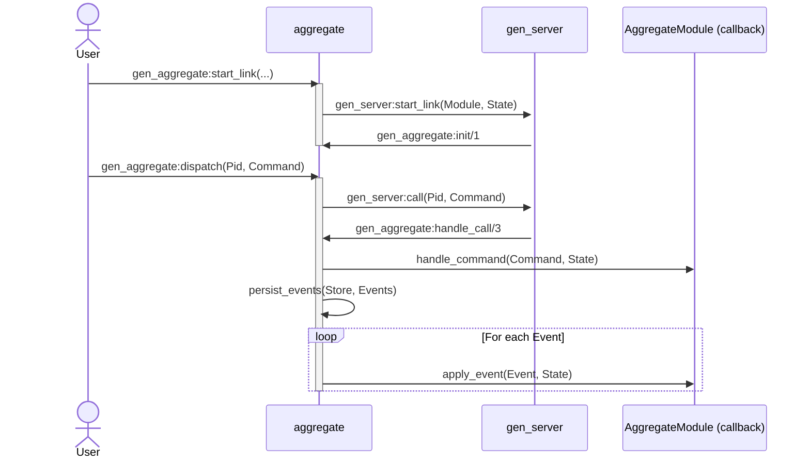
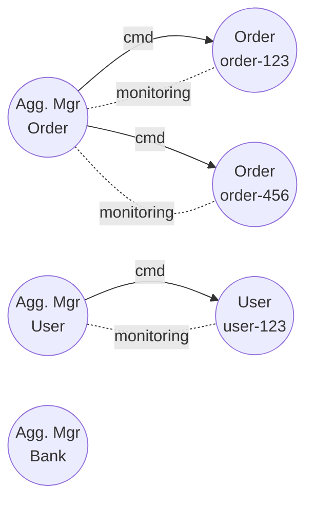

# erlang-event-sourcing-xp

> 🧪 Experimenting with Event Sourcing in Erlang using _pure functional_ principles, [gen_server](https://www.erlang.org/doc/apps/stdlib/gen_server.html)-based aggregates, and _pluggable_ Event Store backends.

[](https://www.erlang.org/)
[](https://github.com/ccamel/erlang-event-sourcing-xp/actions/workflows/lint.yml)
[](https://github.com/ccamel/erlang-event-sourcing-xp/actions/workflows/build.yml)
[](https://github.com/ccamel/erlang-event-sourcing-xp/actions/workflows/test.yml)

[](https://github.com/ccamel/erlang-event-sourcing-xp/releases)
[](https://github.com/semantic-release/semantic-release)
[](https://github.com/ccamel/erlang-event-sourcing-xp/blob/main/LICENSE)

## About

I'm a big fan of [Erlang/OTP][Erlang] and [Event Sourcing], and I strongly believe that the _Actor Model_ and _Event Sourcing_ are a natural fit. This repository is my way of exploring how these two concepts can work together in practice.

As an **experiment**, this repo won't cover every facet of event sourcing in depth, but it should provide some insights and spark ideas on the potential of this approach in [Erlang].

[Erlang]: https://www.erlang.org/
[Event Sourcing]: https://learn.microsoft.com/en-us/azure/architecture/patterns/event-sourcing

## Features

- **Aggregate** — a reusable [gen_server](https://www.erlang.org/doc/apps/stdlib/gen_server.html) harness that keeps domain logic pure while delegating event sourcing boilerplate.
- **Aggregate Manager** — a router and lifecycle supervisor that spins up aggregates on demand, rehydrates them from persisted events, and passivates idle instances.
- **Event Store** — a behaviour-driven abstraction with drop-in backends so you can pick the storage engine that fits your deployment.
- **Snapshots** — automatic checkpointing at configurable intervals to avoid replaying entire streams.
- **Passivation** — idle aggregates are shut down cleanly and will rehydrate from the store on the next command.

### Backend roadmap

| Backend                                                                     | Status     | Icon                                                                                                                               | Capabilities | Highlights                                                                                     | Ideal use cases                                                                                   |
| --------------------------------------------------------------------------- | ---------- | ---------------------------------------------------------------------------------------------------------------------------------- | ------------ | ---------------------------------------------------------------------------------------------- | ------------------------------------------------------------------------------------------------- |
| [ETS](https://www.erlang.org/doc/apps/stdlib/ets.html)       | ✅ Ready   |      | Events + snapshots | In-memory tables backed by the BEAM VM, blazing-fast reads/writes, zero external dependencies. | Local development, benchmarks, ephemeral environments where latency matters more than durability. |
| [Mnesia](https://www.erlang.org/docs/29/apps/mnesia/mnesia.html) | ✅ Ready   |      | Events + snapshots | Distributed, transactional, and replicated storage built into Erlang/OTP.                      | Clusters that need lightweight distribution without introducing an external database.             |
| [PostgreSQL](https://www.postgresql.org/)                                   | 🛠️ Planned |  | Events + snapshots | Durable SQL store with strong transactional guarantees and easy horizontal scaling.            | Production setups that already rely on Postgres or need rock-solid consistency.                   |
| [MongoDB](https://www.mongodb.com/)                                         | 🛠️ Planned |     | Events + snapshots | Flexible document database with built-in replication and sharding.                             | Event streams that benefit from schemaless payload storage or multi-region clusters.              |

## Let's play

This project is a work in progress, and I welcome any feedback or contributions. If you're interested in [Event Sourcing](https://learn.microsoft.com/en-us/azure/architecture/patterns/event-sourcing), [Erlang/OTP](https://www.erlang.org/), or both, feel free to reach out!

Start the Erlang [shell](https://www.erlang.org/docs/20/man/shell.html) and run the following commands to play with the example:

<!-- DEMO-START -->

```erlang
%% Interactive demo showcasing the event sourcing engine.
%%
%% The example uses a simple "bank account" aggregate: a single stream
%% of domain events representing deposits and withdrawals.
%% Each command sent to the aggregate produces an event persisted
%% through the in-memory ETS backend (used here for both events
%% and snapshots).

%% Usage:
%%     rebar3 shell < examples/demo_bank.script

StoreContext = {event_sourcing_store_ets, event_sourcing_store_ets},

io:format("~n[1] starting in-memory store (ETS)~n", []),
StartRes = event_sourcing_core_store:start(StoreContext),
io:format(" -> ~p~n", [StartRes]),

io:format("[2] starting bank account aggregate manager~n", []),
{ok, BankMgr} =
    event_sourcing_core_mgr_aggregate:start_link(
        bank_account_aggregate,
        StoreContext,
        bank_account_aggregate
    ),
io:format(" -> BankMgr pid: ~p~n", [BankMgr]),

AccountId = <<"bank-account-123">>,

io:format("[3] deposit $100~n", []),
Res1 = event_sourcing_core_mgr_aggregate:dispatch(
    BankMgr,
    {bank, deposit, AccountId, 100}
),
io:format(" -> ~p~n", [Res1]),

io:format("[4] withdraw $10~n", []),
Res2 = event_sourcing_core_mgr_aggregate:dispatch(
    BankMgr,
    {bank, withdraw, AccountId, 10}
),
io:format(" -> ~p~n", [Res2]),

io:format("[5] withdraw $1000 (should fail)~n", []),
Res3 = event_sourcing_core_mgr_aggregate:dispatch(
    BankMgr,
    {bank, withdraw, AccountId, 1000}
),
io:format(" -> ~p~n", [Res3]),

ok.
```
<!-- DEMO-END -->

## Architecture

### Overview

This project is structured around the core principles of Event Sourcing:

- All changes are represented as immutable events.
- Aggregates handle commands and apply events to evolve their state.
- State is rehydrated by replaying historical events. Possible optimizations include snapshots and caching.

### Event store

The event store is a core component in this experiment, designed as a customizable `behaviour` that any `module` can implement to handle event storage. Its primary responsibilities include storing and retrieving events.

```erlang
% Initializes the event store
-callback start() -> {ok, initialized | already_initialized} | {error, term()}.

% Shuts down the event store.
-callback stop() -> {ok} | {error, term()}.

% Persists a list of events for a given stream.
-callback persist_events(StreamId, Events) -> ok | {error, term()}
    when StreamId :: stream_id(),
         Events :: [event()].

% Retrieves events from a stream and folds them using a provided function
-callback retrieve_and_fold_events(StreamId, Options, FoldFun, InitialAcc) -> {ok, Acc} | {error, term()}
    when StreamId :: stream_id(),
         Options :: fold_events_opts(),
         FoldFun :: fold_events_fun(),
         InitialAcc :: Acc.
```

#### Snapshot Support

The event store supports snapshotting to optimize aggregate rehydration. Instead of replaying all events from the beginning, aggregates can:

1. Load the latest snapshot (if available)
2. Replay only events that occurred after the snapshot
3. Automatically create new snapshots at configurable intervals

**Snapshot Callbacks:**

```erlang
% Save a snapshot of aggregate state
-callback save_snapshot(Snapshot) -> ok when Snapshot :: snapshot().

% Retrieve the latest snapshot for a stream
-callback retrieve_latest_snapshot(StreamId) -> {ok, Snapshot} | {error, not_found}.
```

The snapshot record contains all necessary fields (domain, stream_id, sequence, timestamp, state), making the API consistent with event persistence where events are passed as complete records.

**Configuring Snapshots:**

```erlang
% Start aggregate with snapshot every 10 events
event_sourcing_core_aggregate:start_link(
    Module,
    Store,
    Id,
    #{snapshot_interval => 10}
).
```

When `snapshot_interval` is set to a positive integer, a snapshot is automatically saved whenever the aggregate's sequence number is a multiple of that interval.

#### Additional future features

- Support event subscriptions for real-time updates.
- Implement snapshot retention policies (e.g., keep only last N snapshots).

#### Current Implementation

- [Mnesia](https://www.erlang.org/doc/apps/mnesia/mnesia.html)
- [ETS](https://www.erlang.org/doc/apps/stdlib/ets.html)

### Aggregate

The _aggregate_ is implemented as a [gen_server](https://www.erlang.org/doc/apps/stdlib/gen_server.html) that encapsulates _domain logic_ and delegates event persistence to a pluggable Event Store (e.g. [ETS](https://www.erlang.org/doc/apps/stdlib/ets.html) or [Mnesia](https://www.erlang.org/doc/apps/mnesia/mnesia.html)).

The core idea is to separate concerns between domain behavior and infrastructure. To achieve this, the system is structured into three main components:

- 🧩 **Domain Module** — a pure module that implements domain-specific logic via _behaviour_ callbacks.
- ⚙️ **`aggregate`** — the glue that bridges domain logic and infrastructure (event sourcing logic, event persistence, etc.).
- 🚦 [`gen_server`](https://www.erlang.org/doc/apps/stdlib/gen_server.html) — the OTP mechanism that provides lifecycle management and message orchestration.

The `aggregate` provides:

- A [behaviour](https://www.erlang.org/doc/system/design_principles.html#behaviours) for domain-specific modules to implement.
- A generic [OTP](https://www.erlang.org/doc/system/design_principles.html) [gen_server](https://www.erlang.org/doc/apps/stdlib/gen_server.html) that:
  - Rehydrates state from events on startup (with optional snapshot loading).
  - Processes commands to produce events.
  - Applies events to evolve internal state.
  - Automatically passivates (shuts down) after inactivity.
  - Saves snapshots at configurable intervals for optimization.

The following diagram shows how the system processes a command using the event-sourced aggregate infrastructure.



#### Passivation

Each aggregate instance (a `gen_server`) is automatically passivated — i.e., stopped — after a period of inactivity.

This helps:

- Free up memory in long-lived systems
- Keep the number of live processes bounded
- Rehydrate state on demand from the event store

Passivation is configured via a `timeout` value when the aggregate is started (defaults to 5000 ms):

```erlang
event_sourcing_core_aggregate:start_link(Module, Store, Id, #{timeout => 10000}).
```

When no messages are received within the timeout window:

- A passivate message is sent to the process.
- The aggregate process exits normally (`stop`).
- Its state is discarded.
- Future commands will cause the manager to rehydrate it from persisted events.

#### Snapshots

Snapshots provide a performance optimization for aggregate rehydration by avoiding the need to replay all events from the beginning of a stream.

**How it works:**

1. **On startup**, the aggregate:

   - Attempts to load the latest snapshot from the event store
   - If found, initializes state from the snapshot
   - Replays only events that occurred after the snapshot sequence

2. **During command processing**, snapshots are automatically created when:
   - A `snapshot_interval` is configured (e.g., `10`)
   - The current sequence number is a multiple of the interval
   - For example, with `snapshot_interval => 10`, snapshots are saved at sequences 10, 20, 30, etc.

**Configuration:**

```erlang
% Create aggregate with snapshots every 10 events
event_sourcing_core_aggregate:start_link(
    bank_account_aggregate,
    event_sourcing_store_ets,
    <<"account-123">>,
    #{
        timeout => 5000,
        snapshot_interval => 10  % Save snapshot every 10 events
    }
).
```

Setting `snapshot_interval => 0` (the default) disables automatic snapshotting.

### Aggregate Manager

The _aggregate manager_ is implemented as a [gen_server](https://www.erlang.org/doc/apps/stdlib/gen_server.html). It serves as a router and supervisor for aggregate processes, ensuring that commands are dispatched to the correct aggregate instance based on their stream ID.

The manager is responsible for:

- Routing commands to the appropriate aggregate process.
- Managing the lifecycle of aggregate instances, starting new ones as needed.
- Monitoring aggregate processes and cleaning up when they terminate.

#### How it works

The aggregate manager maintains a mapping of stream IDs to aggregate process PIDs. When a command is received:

1. The `Router` module extracts the target aggregate type and stream ID from the command.
2. If the aggregate type matches the manager’s configured `Aggregate` module:
   - The manager checks its internal `pids` map for an existing process for the stream ID.
   - If none exists, it spawns a new `event_sourcing_core_aggregate` process using the provided Aggregate, Store, and stream ID, then monitors it.
   - The command is forwarded to the aggregate process via `event_sourcing_core_aggregate:dispatch/2`.
3. If the aggregate type mismatches or routing fails, an error is returned.



#### Options

The manager can be configured with options such as:

- `timeout`: Timeout for operations.
- `sequence_zero`: Function to initialize event sequences.
- `sequence_next`: Function to increment sequences.
- `now_fun`: Function to provide timestamps.

### Project organization

```plaintext
apps/
├── event_sourcing_contract
│   ├── include/event_sourcing.hrl                  % Shared types and records
│   └── src                                         % Public behaviours (the contract)
│       ├── event_sourcing_contract.app.src
│       ├── event_sourcing_aggregate_behaviour.erl
│       ├── event_sourcing_event_store_behaviour.erl
│       └── event_sourcing_snapshot_store_behaviour.erl
├── event_sourcing_core
│   ├── src                                         % Core processes built on the contract
│   │   ├── event_sourcing_core.app.src
│   │   ├── event_sourcing_core_aggregate.erl
│   │   ├── event_sourcing_core_mgr_aggregate.erl
│   │   ├── event_sourcing_core_mgr_behaviour.erl
│   │   └── event_sourcing_core_store.erl
│   └── test                                        % Aggregate + store suites
├── event_sourcing_store_ets
│   ├── src/event_sourcing_store_ets.erl            % ETS-backed store implementation
│   └── test                                        % ETS-focused tests (planned)
└── event_sourcing_store_mnesia
    ├── src/event_sourcing_store_mnesia.erl         % Mnesia-backed store implementation
    └── test                                        % Mnesia-focused tests (planned)
```

## Build

```sh
rebar3 compile
```

## Test

```sh
rebar3 eunit
```

## Lint

```sh
rebar3 do dialyzer, fmt --check
```

`dialyzer` runs the type analysis, while `fmt --check` makes sure all Erlang sources are already formatted.
